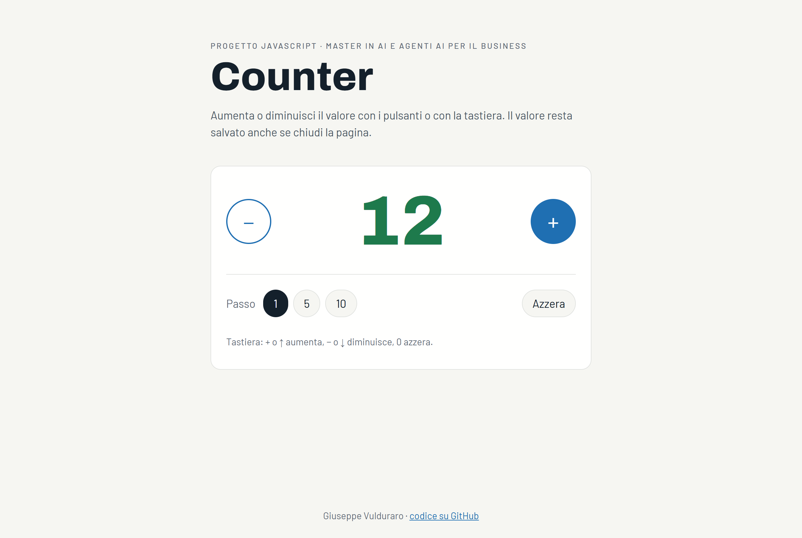
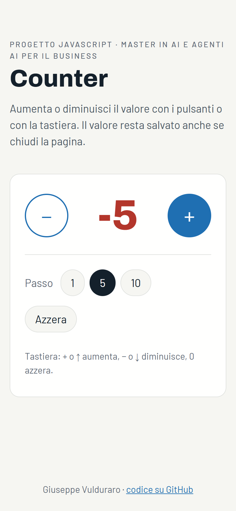

# Counter

**▶ Prova l'applicazione: <https://giuvul.github.io/counter-app/>**

Un counter in **JavaScript puro**: l'utente aumenta o diminuisce un valore con i
pulsanti **+** e **−**. Tutta l'interfaccia (pulsanti e valore) viene creata
dinamicamente con la manipolazione del DOM; l'HTML contiene solo il contenitore
vuoto `<div id="app">`.

Progetto del modulo JavaScript del Master in AI e Agenti AI per il Business
(Università degli Studi Guglielmo Marconi).



## Funzionalità

- **Valore iniziale 0** alla prima apertura della pagina.
- **Pulsanti + e −** per aumentare e diminuire il valore.
- **Passo regolabile**: 1, 5 o 10 a ogni clic.
- **Azzera** per tornare a 0.
- **Salvataggio automatico** del valore e del passo nel `localStorage`: il
  counter riparte da dove l'avevi lasciato.
- **Tastiera**: `+` o `↑` aumenta, `−` o `↓` diminuisce, `0` azzera.
- **Colore del valore**: verde se positivo, rosso se negativo.
- **Accessibile**: il valore è un `<output>` con `aria-live`, i pulsanti hanno
  etichette che indicano il passo, il focus è sempre visibile.
- **Responsive**: funziona anche su smartphone.



## Struttura del progetto

```
.
├── index.html        pagina: titolo, contenitore #app, caricamento degli script
├── css/
│   └── style.css     stile dell'applicazione
├── js/
│   ├── counter.js    logica: stato iniziale, incremento, decremento, azzeramento, passo
│   ├── storage.js    salvataggio e lettura del counter nel localStorage
│   ├── view.js       interfaccia: creazione degli elementi nel DOM e visualizzazione del valore
│   └── main.js       punto di ingresso: collega eventi, logica, salvataggio e interfaccia
├── img/              favicon e screenshot
└── fonts/            font Archivo e Barlow (woff2)
```

## Come funziona il codice

Ogni file ha un solo compito, e la logica è separata dalla visualizzazione.

1. **Cambio valore** (`counter.js`). Il counter è un oggetto `{ value, step }`.
   Le funzioni `increment`, `decrement`, `reset` e `setStep` ricevono il counter
   e ne restituiscono uno nuovo, senza toccare la pagina.
2. **Visualizzazione del valore** (`view.js`). `buildCounter` crea con
   `document.createElement` i pulsanti, il valore e i controlli del passo;
   `renderCounter` aggiorna testo, colore e stato dei pulsanti.
3. **Salvataggio** (`storage.js`). `loadCounter` e `saveCounter` leggono e
   scrivono nel `localStorage`; se i dati non sono validi o lo storage non è
   disponibile, il counter riparte da 0 e funziona comunque.
4. **Collegamento** (`main.js`). Ogni clic o tasto chiama `update`, che applica
   la modifica, salva e ridisegna:

```js
function update(change) {
  counter = change(counter);
  saveCounter(counter);
  renderCounter(elements, counter);
}

elements.plusButton.addEventListener("click", () => update(increment));
elements.minusButton.addEventListener("click", () => update(decrement));
```

Gli script sono file classici caricati in ordine in fondo a `index.html`, così
l'applicazione funziona anche aprendo il file direttamente dal disco, senza
server.

## Provarlo in locale

```bash
git clone https://github.com/giuvul/counter-app.git
cd counter-app
```

Poi apri `index.html` nel browser (doppio clic). Non servono installazioni.

## Tecnologie

- HTML5
- CSS3 (Grid, Flexbox, custom properties)
- JavaScript (ES6+), senza librerie né framework

## Autore

**Giuseppe Vulduraro** · [giuvul.github.io](https://giuvul.github.io/) ·
[GitHub](https://github.com/giuvul)
